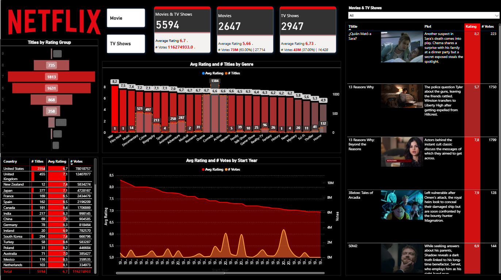

# Netflix TV Show &amp; Movie Analysis
by Zoleka Magagula

# Objective 
This project aims to compare the performance of TV shows and movies, using customer satisfaction as the main metric. By analyzing ratings and votes, it evaluates how well different titles are performing. The dashboard also includes images and summaries of each show and movie, offering a comprehensive overview and insightful analysis of Netflix's performance.

## Movies DAX Measures Created: 
``` 
Movie Title = 
CALCULATE(
    COUNT(Listings[Listings Type]), 
    Listings[Listings Type] = "Movie"
)

Movie Votes
Movie Votes = 
CALCULATE(
    SUM(Listings[Votes]), 
    Listings[Type] = "Movie"
)

% Movie Titles
% Movie Titles = 
DIVIDE(
    CALCULATE(
        COUNTROWS(Listings), 
        Listings[Listings Type] = "Movie"
    ), 
    COUNTROWS(Listings), 
    0
)

% Movie Votes Label = 
VAR _percentoftotal = FORMAT(ROUND(DIVIDE([# Movie Votes],[# Votes], 0), 2) * 100, "0.00") 
VAR _votespertitle = FORMAT(ROUND(DIVIDE([# Movie Votes], [# Movie Title], 0), 0), "#,##0")
RETURN
"(" & _percentoftotal & "%) | " & _votespertitle & " votes per title"

Movie AVG Rating
Movie AVG Rating = 
CALCULATE(
    AVERAGE(Listings[Rating Group]), 
    Listings[Listings Type] = "Movie"
)
```
## Television DAX Measures Created: 
```
TV Title = CALCULATE(
    COUNT(Listings[Listings Type]) ,Listings[Listings Type] = "TV Shows")

TV Votes = CALCULATE(SUM(Listings[Votes]), Listings[Listings Type] = "TV Shows")

% TV Titles = 
DIVIDE(
    CALCULATE(
        COUNTROWS(Listings), 
        Listings[Listings Type] = "TV Shows"
    ), 
    COUNTROWS(Listings), 
    0
)

% TV Votes Label = 
VAR _percentoftotal = FORMAT(ROUND(DIVIDE([# TV Votes],[# Votes], 0), 2) * 100, "0.00") 
VAR _votespertitle = FORMAT(ROUND(DIVIDE([# TV Votes], [# TV Title], 0), 0), "#,##0")

RETURN
"(" & _percentoftotal & "%) | " & _votespertitle & " votes per title"

TV AVG Rating = CALCULATE(
    AVERAGE(Listings[Rating Group]),
    Listings[Listings Type] = "TV Shows"
)
```


